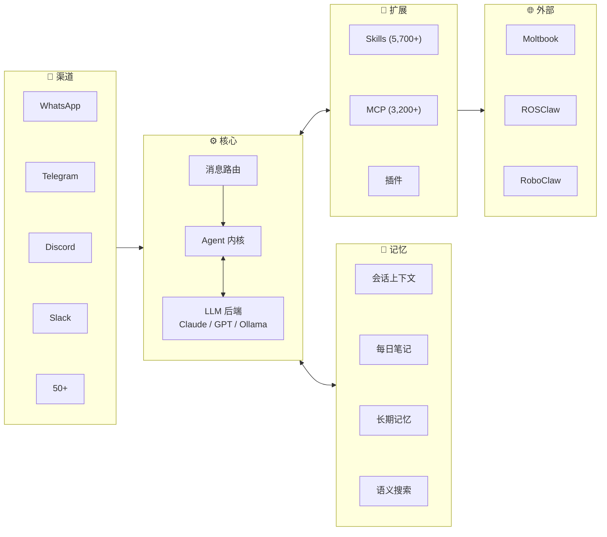

# Awesome-OpenClaw-Research [](https://awesome.re)


🦞 **OpenClaw** 于 2025 年 11 月上线，**84 天**突破 20 万 GitHub 星标，截至 2026 年 3 月已超过 **33 万星**。本仓库是面向**学术研究**的 OpenClaw 生态系统论文、分析与资源精选集 —— 增长最快的开源 AI Agent 框架。

<p align="center">
  <a href="#-论文"></a>
  <a href="https://github.com/openclaw/openclaw"></a>
  <a href="./README.md"></a>
  <a href="#-贡献指南"></a>
  <a href="https://join.slack.com/t/openclaw-research/shared_invite/zt-3tetckn5x-tOKVsEEQN8ArnyxzqgWsAA"></a>
</p>

---

## 目录

- [论文](#-论文) — **本仓库核心**
  - [核心架构与系统](#核心架构与系统)
  - [强化学习与自我进化](#强化学习与自我进化)
  - [安全与信任](#安全与信任)
  - [具身 AI 与机器人](#具身-ai-与机器人)
  - [Agent 社会行为](#agent-社会行为)
  - [个人化 Agent](#个人化-agent相关工作)
- [架构](#-架构)
- [生态时间线](#-生态时间线)
- [其他资源](#-其他资源) — SDK、工具、社区、相关仓库
- [贡献指南](#-贡献指南)

---

## 📄 论文

> 仅 2026 年 2-3 月就发表 15+ 篇论文。每条记录包含论文链接、代码链接（如有）及核心要点。

### 核心架构与系统

| 标题 | 来源 | 日期 | 论文 | 代码 | 要点 |
|------|------|------|------|------|------|
| **AgentOS: NL-Driven OS Paradigm** | arXiv | 2026.03 | [](https://arxiv.org/abs/2603.08938) |  | 以 Agent 为中心的 OS 范式；Skills-as-Modules；KDD 建模 |
| **OpenClaw as Language Infrastructure (Survey)** | Preprints.org | 2026.03 | [](https://www.preprints.org/manuscript/202603.1060) |  | GATE / AERO 框架；分析 38 篇生态论文 |

### 强化学习与自我进化

| 标题 | 来源 | 日期 | 论文 | 代码 | 要点 |
|------|------|------|------|------|------|
| **OpenClaw-RL: Train Any Agent Simply by Talking** | arXiv | 2026.03 | [](https://arxiv.org/abs/2603.10165) | [](https://github.com/Gen-Verse/OpenClaw-RL) | 评估+指导信号；异步四组件 RL 架构 |
| **MetaClaw: Meta-Learning in the Wild** | arXiv | 2026.03 | [](https://arxiv.org/abs/2603.17187) |  | 持续元学习；技能驱动适应；准确率 21.4% → 40.6% |

### 安全与信任

| 标题 | 来源 | 日期 | 论文 | 代码 | 要点 |
|------|------|------|------|------|------|
| **PASB: Benchmarking Attacks on OpenClaw** | arXiv | 2026.02 | [](https://arxiv.org/abs/2602.08412) | [](https://github.com/AstorYH/PASB) | 端到端安全评估；原生防御率仅 17% |
| **Don't Let the Claw Grip Your Hand** | arXiv | 2026.03 | [](https://arxiv.org/abs/2603.10387) |  | 47 种对抗场景；HITL 防御：17% → 19-92% |
| **SkillFortify: Formal Supply Chain Security** | arXiv | 2026.03 | [](https://arxiv.org/abs/2603.00195) | [](https://github.com/qualixar/skillfortify) [](https://pypi.org/project/skillfortify/) | 96.95% F1；0% 假阳性；支持 22 个框架 |
| **OpenClaw PRISM: Runtime Security Layer** | arXiv | 2026.03 | [](https://arxiv.org/abs/2603.11853) |  | 纵深防御；零分叉；防提示注入 |

### 具身 AI 与机器人

| 标题 | 来源 | 日期 | 论文 | 代码 | 要点 |
|------|------|------|------|------|------|
| **RoboClaw: Agentic Framework for Robotic Tasks** | arXiv | 2026.03 | [](https://arxiv.org/abs/2603.11558) | [](https://github.com/MINT-SJTU/RoboClaw) | 纠缠动作对；成功率 +25%；人力 −53.7% |
| **ROSClaw: Bridging OpenClaw with ROS 2** | GitHub | 2026.03 | [](https://openclaws.io/blog/openclaw-robotics-embodied-ai) | [](https://github.com/PlaiPin/rosclaw) | SF Hackathon 冠军；Unitree G1/H1、DJI；可在 RPi4 运行 |

### Agent 社会行为

| 标题 | 来源 | 日期 | 论文 | 代码 | 要点 |
|------|------|------|------|------|------|
| **From Agent-Only Social Networks to Autonomous Research** | arXiv | 2026.02 | [](https://arxiv.org/abs/2602.19810) |  | OpenClaw → Moltbook → ClawdLab；Sybil 抵抗 |
| **OpenClaw Agents as Informal Learners at Moltbook** | arXiv | 2026.02 | [](https://arxiv.org/abs/2602.18832) |  | 280 万 Agent 的非正式学习行为 |
| **Peer Learning in the Moltbook Community** | arXiv | 2026.02 | [](https://arxiv.org/abs/2602.14477) |  | 240 万 Agent 的同伴学习模式 |
| **Risky Sharing & Norm Enforcement** | arXiv | 2026.02 | [](https://arxiv.org/abs/2602.02625) |  | Agent 社区风险指令共享与规范自治 |

### 个人化 Agent（相关工作）

| 标题 | 来源 | 日期 | 论文 | 代码 | 要点 |
|------|------|------|------|------|------|
| **Toward Personalized LLM-Powered Agents** | arXiv | 2026.02 | [](https://arxiv.org/abs/2602.22680) |  | 四大组件：Profile / Memory / Planning / Action |

---

## 🏗 架构



---

## 📅 生态时间线

```
2025.11 ─── 上线 (ClawdBot / Moltbot → OpenClaw)
    │
2025.12 ─── ClawHub 技能市场
    │
2026.01 ─── Moltbook (150万Agent/72h) ─── 学术论文爆发 (6篇/2周)
    │
2026.02 ─── ClawHavoc 攻击 ─── CVE-2026-25253 ─── 200k Stars (84天)
    │         │
    │         └── 安全响应: VirusTotal + 审核机制
    │
2026.03 ─── RL/元学习/机器人论文密集期 ─── 330k Stars
    │
    └── ROSClaw Hackathon 冠军 ─── v2026.3.13-1 (第68版)
              │
              └── 微信官方 ClawBot 插件 (03.22)
                    │
                    └── 国家网络安全通报中心预警 (03.13)
```

<details>
<summary><b>完整时间线</b></summary>

| 日期 | 事件 |
|------|------|
| 2025.11.24 | OpenClaw（原 ClawdBot / Moltbot）上线 |
| 2025.12 | ClawHub 技能市场发布 |
| 2026.01 | Moltbook 上线 — 72h 内注册 150 万 Agent |
| 2026.01 | 两周内产出 6 篇学术论文 |
| 2026.02.02 | Risky Sharing & Norm Enforcement 论文发表 |
| 2026.02 | PASB 安全评估框架论文发表 |
| 2026.02 | ClawHavoc 供应链攻击 — 1,184 个恶意技能 |
| 2026.02 | CVE-2026-25253 披露（RCE，CVSS 8.8） |
| 2026.02.16 | GitHub Stars 突破 200k（84 天） |
| 2026.02 | OpenClaw + VirusTotal 安全合作 |
| 2026.03 | OpenClaw-RL / MetaClaw / AgentOS / RoboClaw 等论文发表 |
| 2026.03 | ROSClaw 赢得 SF OpenClaw Hackathon |
| 2026.03.13 | v2026.3.13-1 发布（第 68 版） |
| 2026.03.13 | 国家网络安全通报中心安全预警 |
| 2026.03.22 | 微信官方 ClawBot 插件发布 |
| 2026.03 | GitHub Stars 突破 330k |

</details>

---

## 📦 其他资源

<details>
<summary><b>官方链接</b></summary>

| 名称 | 链接 |
|------|------|
| OpenClaw 核心 | [github.com/openclaw/openclaw](https://github.com/openclaw/openclaw) |
| ClawHub 市场 | [clawhub.com](https://clawhub.com) |
| 官方文档 | [docs.openclaw.ai](https://docs.openclaw.ai) |

</details>

<details>
<summary><b>SDK 与工具</b></summary>

| 名称 | 语言 | 说明 |
|------|------|------|
| [openclaw-sdk](https://masteryodaa.github.io/openclaw-sdk/) | Python | 构建与发布 AI Agent |
| [mcp-bridge-openclaw](https://www.npmjs.com/package/mcp-bridge-openclaw) | TypeScript | MCP 多服务器桥接 |
| [amor71/openclaw-mcp](https://github.com/amor71/openclaw-mcp) | TypeScript | 原生 MCP 客户端 |
| [henry-y/openclaw-paper-tools](https://github.com/henry-y/openclaw-paper-tools) | Python | OpenClaw arXiv 论文阅读助手 |

</details>

<details>
<summary><b>安全参考</b></summary>

| 名称 | 链接 |
|------|------|
| PASB 框架 | [GitHub](https://github.com/AstorYH/PASB) |
| SkillFortify | [GitHub](https://github.com/qualixar/skillfortify) · [PyPI](https://pypi.org/project/skillfortify/) |
| CVE-2026-25253 | [NVD](https://nvd.nist.gov/vuln/detail/CVE-2026-25253) |
| 安全指南 | [bitdoze.com](https://www.bitdoze.com/openclaw-security-guide/) |

</details>

<details>
<summary><b>中文社区</b></summary>

| 名称 | 链接 | 说明 |
|------|------|------|
| OpenClaw China | [BytePioneer-AI/openclaw-china](https://github.com/BytePioneer-AI/moltbot-china) | 国内 IM 平台适配（3,200+ Stars） |
| 中文社区 | [clawd.org.cn](https://clawd.org.cn) | 飞书 / 钉钉 / 企微 / QQ |
| 中文教程 | [openclawgithub.cc](https://openclawgithub.cc) | 配置与接入指南 |
| Hello Claw | [Datawhale](https://datawhalechina.github.io/hello-claw/) | Datawhale 教程 |
| 中文站 | [clawcn.net](https://clawcn.net) | 国产大模型指南 |
| Learn OpenClaw | [learnopenclaw.com](https://learnopenclaw.com) | 学习平台 |

</details>

<details>
<summary><b>相关仓库</b></summary>

> 发现了我们遗漏的好项目？欢迎提交 PR 帮助完善这份清单！

| 仓库 | Stars | 说明 |
|------|-------|------|
| [SamurAIGPT/awesome-openclaw](https://github.com/SamurAIGPT/awesome-openclaw) | 823 | OpenClaw 资源、工具、技能、教程与文章大全 |
| [mergisi/awesome-openclaw-agents](https://github.com/mergisi/awesome-openclaw-agents) | 830+ | 177 个生产级 AI Agent 模板，覆盖 24 个领域 |
| [VoltAgent/awesome-openclaw-skills](https://github.com/VoltAgent/awesome-openclaw-skills) | — | 社区精选技能合集 |
| [community/openclaw-recipes](https://github.com/community/openclaw-recipes) | — | 常用自动化配方 |
| [templates/claw-templates](https://github.com/templates/claw-templates) | — | OpenClaw 项目模板 |
| [pranciskus/discourse-openclaw](https://github.com/pranciskus/discourse-openclaw) | NEW | Discourse 论坛集成，12 个工具 |
| [wanikua/ByeByeClaw](https://github.com/wanikua/byebyeclaw) | NEW | 一键卸载所有 Claw 系列 Agent |

</details>

---

## 🤝 贡献指南

欢迎贡献！特别是以下方面：

- **论文** — 补充遗漏的 OpenClaw 相关论文，附带完整链接
- **分析** — 完善论文笔记与要点
- **时间线** — 更新生态时间线
- **翻译** — 中英文内容互译

请通过 [Pull Request](https://github.com/shuolucs/Awesome-OpenClaw-Research/pulls) 提交。英文版请查看 [README.md](./README.md)。

---

## ⭐ Star History

如果这个项目对你有帮助，请给个 Star！

[](https://star-history.com/#shuolucs/Awesome-OpenClaw-Research&Date)
